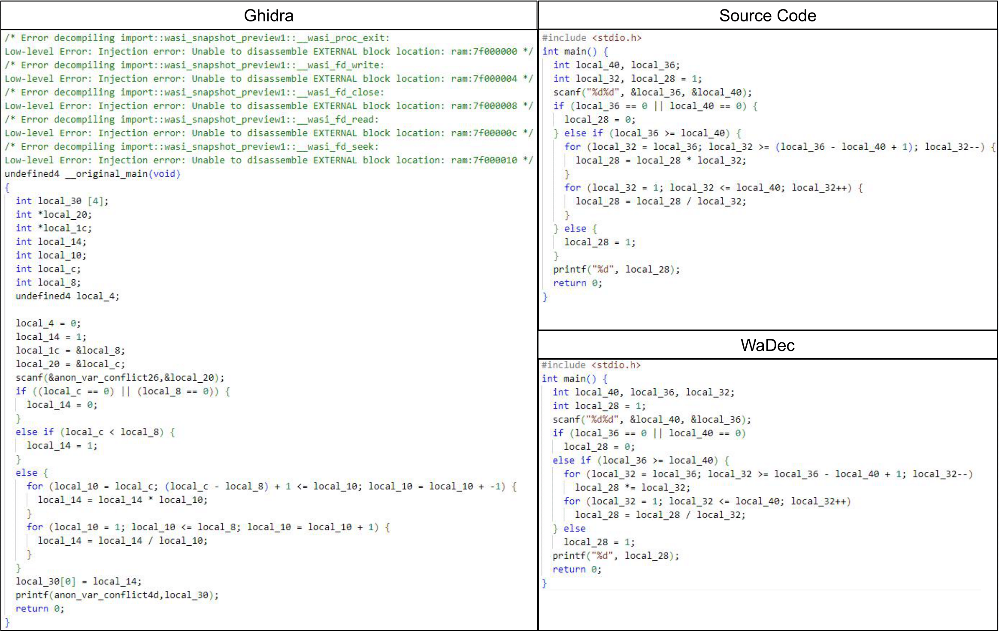

### A comparation between WaDec and Ghidra

We can see apparent issues with the decompilation result of the Wasm plugin in Ghidra. First, there are errors in the decompilation result, which clearly indicates that Ghidra has certain problems with decompiling Wasm. Second, by comparing Ghidra's decompilation result with the source code, we can find that Ghidra cannot recover string constants, which severely affects the semantics and I/O of the code. Moreover, compared with the source code and WaDec's output, there is a significant code bloat. Finally, there are varying degrees of inconsistencies in function names, variable types, and other aspects.

### Limitations of CodeBLEU
During our evaluation phase, we used CodeBLEU as one of our metrics. However, in calculating CodeBLEU, we encountered numerous limitations, particularly its inadequacy in accurately evaluating the similarity of C code in many instances. To illustrate these issues, we have selected several representative examples for case study analysis.

**Dead code.**
Dead code is a typical scenario where CodeBLEU falls short. It fails to identify and exclude code branches that will not be executed. 
As shown in Figure above, it is evident that the code on the left contains unexecutable dead code. Once removed, it becomes identical to the code on the right;
however, CodeBLEU struggles with this. For this perfectly consistent case in human judgment, CodeBLEU only awards a score of 0.62.

**Simple calculation.**
During the compilation of C code into Wasm, even without setting an optimization level (defaulting to O0), simple numerical calculations such as arithmetic operations and 'sizeof', as shown in Figure above, are resolved to specific numbers. Consequently, the decompilation naturally results in numeric values. However, CodeBLEU fails to accurately compare the consistency between these outputs, often resulting in a significantly low score. The more such simple calculations are present, the lower the score tends to be.

**Few variables.**
As shown in Figure above, the data flow score (one of the four evaluation criteria of CodeBLEU, with a weight of 0.25) for these two C code snippets is only 0.1667, which is problematic.
Our experiments discovered that this issue arises from differences between initializations followed by definitions versus definitions during initialization. Researchers use the sequence numbers of leaf nodes in the AST to represent the directions of data flow—both ingress and egress points\cite{ren2020codebleu}. However, the two styles of variable initialization result in distinct ASTs, thereby leading to variations in the data flow vectors.

![Equivalent_transformation]

**Equivalent transformation.**
As illustrated in Figure above, when we perform a forward operation on an element followed by its corresponding inverse operation, the resulting code is merely an equivalent transformation of the original code. However, CodeBLEU assigns a lower score to this new code. This underscores that CodeBLEU still functions more like a text similarity metric, similar to BLEU, and demonstrates a limited capability in accurately assessing code similarity.

In summary, CodeBLEU remains an unsatisfactory metric for evaluating code similarity. It overlooks many code-specific aspects, such as excluding dead code, handling simple computations, adapting data flow representations to handle scenarios with fewer variables, and managing equivalent transformations, particularly in more flexible programming languages. We believe there are three main directions for improving code similarity metrics: First, while code has textual characteristics, it is imperative to emphasize its code-specific features. Therefore, we should introduce more, and richer, code-oriented rather than text-oriented evaluation metrics to balance the weights. Secondly, designing a more rigorous intermediate representation is crucial, such that for logically identical codes, only one corresponding intermediate representation exists. This includes addressing issues like the order of operations that do not affect the logic and potentially optimizing away simple functions. Third, developing a model specifically trained to assess code similarity can leverage the model's understanding capabilities to address the abovementioned issues.

